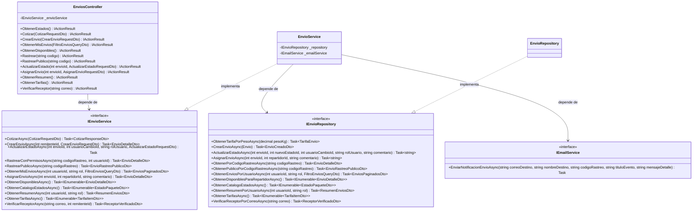

# Nivel 4: Diagrama de código - Módulo de envíos

```mermaid
classDiagram
    class EnviosController {
        -IEnvioService _envioService
        +ObtenerEstados() IActionResult
        +Cotizar(CotizarRequestDto) IActionResult
        +CrearEnvio(CrearEnvioRequestDto) IActionResult
        +ObtenerMisEnvios(FiltroEnviosQueryDto) IActionResult
        +ObtenerDisponibles() IActionResult
        +Rastrear(string codigo) IActionResult
        +RastrearPublico(string codigo) IActionResult
        +ActualizarEstado(int envioId, ActualizarEstadoRequestDto) IActionResult
        +AsignarEnvio(int envioId, AsignarEnvioRequestDto) IActionResult
        +ObtenerResumen() IActionResult
        +ObtenerTarifas() IActionResult
        +VerificarReceptor(string correo) IActionResult
    }

    class IEnvioService {
        <<interface>>
        +CotizarAsync(CotizarRequestDto) Task~CotizarResponseDto~
        +CrearEnvioAsync(int remitenteId, CrearEnvioRequestDto) Task~EnvioDetalleDto~
        +ActualizarEstadoAsync(int envioId, int usuarioCambioId, string rolUsuario, ActualizarEstadoRequestDto) Task
        +RastrearConPermisosAsync(string codigoRastreo, int usuarioId) Task~EnvioDetalleDto~
        +RastrearPublicoAsync(string codigoRastreo) Task~EnvioRastreoPublicoDto~
        +ObtenerMisEnviosAsync(int usuarioId, string rol, FiltroEnviosQueryDto) Task~EnviosPaginadosDto~
        +AsignarEnvioAsync(int envioId, int repartidorId, string comentario) Task~EnvioDetalleDto~
        +ObtenerDisponiblesAsync() Task~IEnumerable~EnvioDetalleDto~~
        +ObtenerCatalogoEstadosAsync() Task~IEnumerable~EstadoPaqueteDto~~
        +ObtenerResumenAsync(int usuarioId, string rol) Task~ResumenEnviosDto~
        +ObtenerTarifasAsync() Task~IEnumerable~TarifaItemDto~~
        +VerificarReceptorAsync(string correo, int remitenteId) Task~ReceptorVerificadoDto~
    }

    class EnvioService {
        -IEnvioRepository _repository
        -IEmailService _emailService
    }

    class IEnvioRepository {
        <<interface>>
        +ObtenerTarifaPorPesoAsync(decimal pesoKg) Task~TarifaEnvio~
        +CrearEnvioAsync(Envio) Task~EnvioCreadoDto~
        +ActualizarEstadoAsync(int envioId, int nuevoEstadoId, int usuarioCambioId, string rolUsuario, string comentario) Task~string~
        +AsignarEnvioAsync(int envioId, int repartidorId, string comentario) Task~string~
        +ObtenerPorCodigoRastreoAsync(string codigoRastreo) Task~EnvioDetalleDto~
        +ObtenerPublicoPorCodigoRastreoAsync(string codigoRastreo) Task~EnvioRastreoPublicoDto~
        +ObtenerEnviosPorUsuarioAsync(int usuarioId, string rol, FiltroEnviosQueryDto) Task~EnviosPaginadosDto~
        +ObtenerDisponiblesParaRepartidorAsync() Task~IEnumerable~EnvioDetalleDto~~
        +ObtenerCatalogoEstadosAsync() Task~IEnumerable~EstadoPaqueteDto~~
        +ObtenerResumenPorUsuarioAsync(int usuarioId, string rol) Task~ResumenEnviosDto~
        +ObtenerTarifasAsync() Task~IEnumerable~TarifaItemDto~~
        +VerificarReceptorPorCorreoAsync(string correo) Task~ReceptorVerificadoDto~
    }

    class EnvioRepository

    class IEmailService {
        <<interface>>
        +EnviarNotificacionEnvioAsync(string correoDestino, string nombreDestino, string codigoRastreo, string tituloEvento, string mensajeDetalle) Task
    }

    EnviosController --> IEnvioService : depende de
    EnvioService ..|> IEnvioService : implementa
    EnvioService --> IEnvioRepository : depende de
    EnvioService --> IEmailService : depende de
    EnvioRepository ..|> IEnvioRepository : implementa
```
