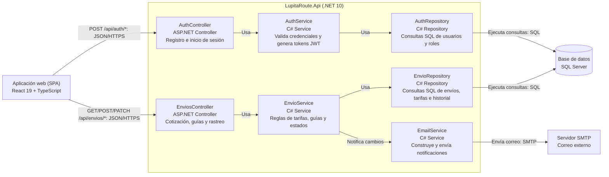

# Nivel 3: Diagrama de componentes

```mermaid
flowchart LR
    spa["Aplicación web (SPA)<br/>React 19 + TypeScript"]
    db[("Base de datos<br/>SQL Server")]
    smtp["Servidor SMTP<br/>Correo externo"]

    subgraph api["LupitaRoute.Api (.NET 10)"]
        authCtrl["AuthController<br/>ASP.NET Controller<br/>Registro e inicio de sesión"]
        enviosCtrl["EnviosController<br/>ASP.NET Controller<br/>Cotización, guías y rastreo"]
        authSvc["AuthService<br/>C# Service<br/>Valida credenciales y genera tokens JWT"]
        envioSvc["EnvioService<br/>C# Service<br/>Reglas de tarifas, guías y estados"]
        emailSvc["EmailService<br/>C# Service<br/>Construye y envía notificaciones"]
        authRepo["AuthRepository<br/>C# Repository<br/>Consultas SQL de usuarios y roles"]
        envioRepo["EnvioRepository<br/>C# Repository<br/>Consultas SQL de envíos, tarifas e historial"]
    end

    spa -->|POST /api/auth/*: JSON/HTTPS| authCtrl
    spa -->|GET/POST/PATCH /api/envios/*: JSON/HTTPS| enviosCtrl
    authCtrl -->|Usa| authSvc
    enviosCtrl -->|Usa| envioSvc
    authSvc -->|Usa| authRepo
    envioSvc -->|Usa| envioRepo
    envioSvc -->|Notifica cambios| emailSvc
    authRepo -->|Ejecuta consultas: SQL| db
    envioRepo -->|Ejecuta consultas: SQL| db
    emailSvc -->|Envía correo: SMTP| smtp
```