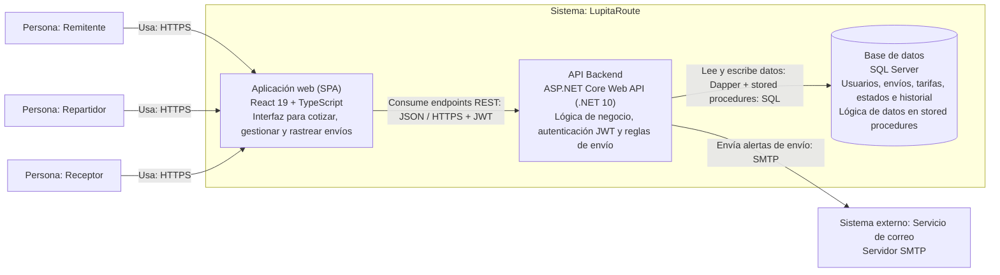

# Nivel 2: Diagrama de contenedores

```mermaid
flowchart LR
    remitente["Persona: Remitente"]
    repartidor["Persona: Repartidor"]
    receptor["Persona: Receptor"]
    smtp["Sistema externo: Servicio de correo<br/>Servidor SMTP"]

    subgraph lupitaroute["Sistema: LupitaRoute"]
        spa["Aplicación web (SPA)<br/>React 19 + TypeScript<br/>Interfaz para cotizar, gestionar y rastrear envíos"]
        api["API Backend<br/>ASP.NET Core Web API (.NET 10)<br/>Lógica de negocio, autenticación JWT y reglas de envío"]
        db[("Base de datos<br/>SQL Server<br/>Usuarios, envíos, tarifas, estados e historial<br/>Lógica de datos en stored procedures")]
    end

    remitente -->|Usa: HTTPS| spa
    repartidor -->|Usa: HTTPS| spa
    receptor -->|Usa: HTTPS| spa
    spa -->|Consume endpoints REST: JSON / HTTPS + JWT| api
    api -->|Lee y escribe datos: Dapper + stored procedures: SQL| db
    api -->|Envía alertas de envío: SMTP| smtp
```