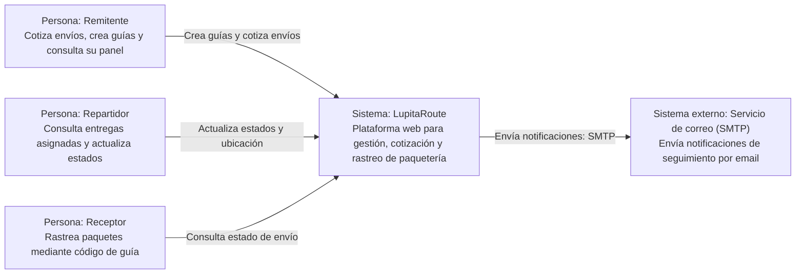

# Nivel 1: Diagrama de contexto

```mermaid
flowchart LR
    remitente["Persona: Remitente<br/>Cotiza envíos, crea guías y consulta su panel"]
    repartidor["Persona: Repartidor<br/>Consulta entregas asignadas y actualiza estados"]
    receptor["Persona: Receptor<br/>Rastrea paquetes mediante código de guía"]
    lupita["Sistema: LupitaRoute<br/>Plataforma web para gestión, cotización y rastreo de paquetería"]
    smtp["Sistema externo: Servicio de correo (SMTP)<br/>Envía notificaciones de seguimiento por email"]

    remitente -->|Crea guías y cotiza envíos| lupita
    repartidor -->|Actualiza estados y ubicación| lupita
    receptor -->|Consulta estado de envío| lupita
    lupita -->|Envía notificaciones: SMTP| smtp
```
